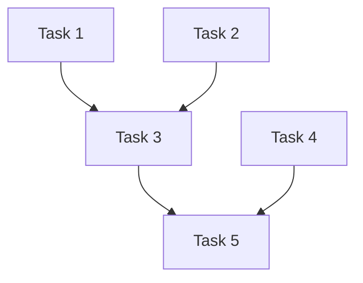

# Task Breakdown

Systematically decompose complex work into implementable tasks. This skill helps you create clear, actionable task plans with proper dependency management.

## Core Principles

### 1. Right-Sized Tasks
Tasks should be:
- **Small enough:** Completable in one focused session (typically 1-4 hours)
- **Large enough:** Meaningful progress, not trivial
- **Independent:** Can be worked on without constant context-switching

### 2. Clear Boundaries
Each task should have:
- Defined start state (what must exist before)
- Defined end state (what exists after)
- Unambiguous acceptance criteria

### 3. Dependency Awareness
Understand what blocks what to enable:
- Parallel execution where possible
- Correct sequencing where necessary
- Early identification of blockers

## Breakdown Process

### Step 1: Understand the Whole

Before breaking down, understand the complete picture:

```
1. What is the end goal?
2. What does "done" look like?
3. What are the major components/areas?
4. What are the known constraints?
5. What are the unknowns/risks?
```

### Step 2: Identify Major Chunks

Divide into logical areas (not sequential steps yet):

```
Feature: User Authentication

Major Chunks:
├── Data Layer (database, models)
├── Auth Logic (validation, tokens, sessions)
├── API Layer (endpoints)
├── Security (hashing, rate limiting)
└── Integration (with existing user system)
```

### Step 3: Decompose Each Chunk

For each major chunk, identify specific tasks:

```
Data Layer:
├── T1: Create users table migration
├── T2: Create sessions table migration
├── T3: Define User model
└── T4: Define Session model

Auth Logic:
├── T5: Implement password hashing
├── T6: Implement token generation
├── T7: Implement token validation
└── T8: Implement session management
```

### Step 4: Map Dependencies

Identify what blocks what:

```
T1 ──┐
     ├──► T3 ──┐
T2 ──┘         │
               ├──► T7 ──► T8
T5 ────────────┤
               │
T6 ────────────┘
```

### Step 5: Identify Parallel Groups

Tasks with no mutual dependencies can run in parallel:

```
Group 1 (parallel):     T1, T2, T5, T6
Group 2 (after G1):     T3, T4
Group 3 (after G2):     T7
Group 4 (after G3):     T8
```

## Task Template

```markdown
### Task [ID]: [Descriptive Name]

**Description:**
[What needs to be done - specific enough to be actionable]

**Dependencies:**
- [Task ID(s) that must complete first, or "None"]

**Inputs:**
- [What this task needs to start]

**Outputs:**
- [What this task produces]

**Acceptance Criteria:**
- [ ] [Specific, verifiable criterion]
- [ ] [Another criterion]

**Files Affected:**
- Create: [new files]
- Modify: [existing files]

**Estimated Complexity:** Low | Medium | High

**Notes:**
- [Any special considerations]
```

## Sizing Guidelines

### Too Big (Break Down Further)
Signs a task is too large:
- "Implement user authentication" (too vague)
- Multiple distinct deliverables
- Estimated > 4 hours
- Multiple areas of codebase affected
- Hard to describe acceptance criteria

### Too Small (Combine)
Signs a task is too small:
- "Add import statement"
- Takes < 15 minutes
- No meaningful standalone value
- Just a step within another task

### Just Right
Good task characteristics:
- Single clear deliverable
- 1-4 hours estimated work
- Testable outcome
- Clear acceptance criteria
- Focused on one area

## Dependency Types

### Hard Dependencies
Must complete before successor can start:
```
T1: Create database table
T2: Write queries using table  ← Cannot start until T1 done
```

### Soft Dependencies  
Should complete first but not strictly required:
```
T1: Design API contract
T2: Implement API  ← Could start with assumptions, but risky
```

### No Dependency
Can run in any order or parallel:
```
T1: Implement feature A
T2: Implement feature B  ← Different files, no interaction
```

## Conflict Detection

Tasks that touch the same files cannot be parallelized:

```
⚠️ CONFLICT: Both modify src/auth/handler.ts
T5: Add login endpoint
T6: Add logout endpoint

Resolution options:
1. Sequence them (T5 → T6)
2. Combine into single task
3. Refactor to separate files first
```

## Risk Assessment

Flag tasks that may be problematic:

```markdown
### Risk Areas

**T7: Implement OAuth Integration**
- Risk: External dependency on OAuth provider
- Mitigation: Have fallback local auth
- Impact if delayed: Blocks T8, T9

**T12: Database Migration**
- Risk: Affects production data
- Mitigation: Test on staging first, have rollback
- Impact if fails: Critical - feature unusable
```

## Output Format: Task Plan

```markdown
# Task Plan: [Feature Name]

## Summary
- **Total Tasks:** [N]
- **Parallel Groups:** [N]
- **Critical Path:** [task sequence]
- **Estimated Total Effort:** [hours/days]

## Dependency Graph



## Parallel Execution Groups

### Group 1 (Start immediately)
- T1: [name]
- T2: [name]
- T4: [name]

### Group 2 (After Group 1)
- T3: [name] (needs T1, T2)

### Group 3 (After Group 2)
- T5: [name] (needs T3, T4)

## Tasks

### T1: [Name]
[Full task details using template]

### T2: [Name]
[Full task details]

...

## Implementation Order

For sequential execution:
1. T1, T2, T4 (parallelizable)
2. T3 (after T1, T2)
3. T5 (after T3, T4)

## Risk Register

| Task | Risk | Likelihood | Impact | Mitigation |
|------|------|------------|--------|------------|
| T7 | External API | Medium | High | Local fallback |

## Notes

- [Any overall considerations]
- [Assumptions made]
```

## Common Patterns

### Feature Implementation
```
1. Data layer (models, migrations)
2. Business logic (services)
3. API/Interface layer
4. Tests
5. Documentation
```

### Bug Fix
```
1. Reproduce and document
2. Write failing test
3. Implement fix
4. Verify fix
5. Add regression test
```

### Refactoring
```
1. Ensure test coverage
2. Small incremental changes
3. Verify after each change
4. Clean up
```

## Anti-Patterns

### "And Then" Tasks
❌ "Create model and write tests and add API"
✅ Separate into: Create model → Write tests → Add API

### Vague Tasks
❌ "Handle errors better"
✅ "Add try-catch to API endpoints with proper error responses"

### Invisible Dependencies
❌ Assuming order without documenting
✅ Explicitly state what each task needs

### Over-Decomposition
❌ "Add semicolon to line 42"
✅ Combine trivial changes into meaningful tasks
